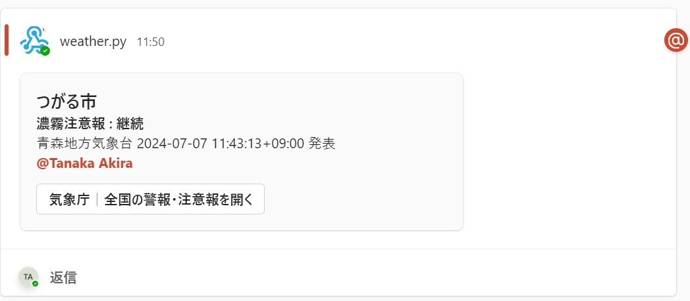

# sample_UseDB

sqlite を使い、下記を実現する

- extra.xml ファイルの 10 分以内取得を行わない
- ある市町に発表された警報・注意報について、状態に変更が無ければ、通知しない
- Microsoft Teamsにメンションをつけて通知可能

## 使い方

1. 本リポジトリをクローンする

   ```
   $ git clone https://github.com/aktnk/weather_warnings.git

   $ cd weather_warinigs/samples/sample_UseDB
   ```

1. pyenv を使い、python 3.10.3 をインストール

   ```
   $ pyenv install 3.10.3

   $ pyenv local 3.10.3
   ```

1. venv で仮想環境を準備する

   ```
   $ python -m venv venv310

   $ source venv310/bin/activate

   (venv310) $ pip install -r requirements.txt
   ```

1. データベースの作成

   ```
   (venv310) $ python models.py
   ```

1. MS Teams へ通知する場合

   1. incomming webhook の URL を環境変数 TEAMS_WEBHOOK、 に設定する

      ```
      (venv310) $ export TEAMS_WEBHOOK=(MS Teamsに設定したincomming webhookのURL)
      (venv310) $ export MENTION_USERID=(MS TeamsのアカウントID)
      (venv310) $ export MENTION_USERNAME=(MS Teamsの表示名)
      ```

   1. 通知先のMSTeamsのインスタンスを作成

     ```
     myteams = MSTeams(WEBHOOK_URL, MENTION_USERID, MENTION_USERNAME)
     ```
     
   1. `weather.py`の`__main__`にて、`printJMAwarningsInfo()`の 3 番目の引数に、通知するMSTeamsのインスタンスを指定する

   （例）下記のようにメンション付きで通知できる
   

1. 指定した市町の警報・注意報を取得する

   ```
   (venv310) $ python weather.py
   without 10 minutes
   xmlfile read:20240621105730_0_VPWW54_220000.xml
   === 裾野市 ===
   Head, title:静岡県気象警報・注意報, reportDateTime:2024-06-21 19:57:00+09:00, infoType:発表, infoKind:気象警報・注意報
   Control, title:気象警報・注意報（Ｈ２７）, datetime:2024-06-21 19:57:30+09:00, status:通常, publishedBy:静岡地方気象台
   Warning, type:気象警報・注意報（市町村等）, city:裾野市, changeStatus:None, Item, kindName:None, status:発表警報・注意報はなし
   ===============
   === 御殿場市 ===
   Head, title:静岡県気象警報・注意報, reportDateTime:2024-06-21 19:57:00+09:00, infoType:発表, infoKind:気象警報・注意報
   Control, title:気象警報・注意報（Ｈ２７）, datetime:2024-06-21 19:57:30+09:00, status:通常, publishedBy:静岡地方気象台
   Warning, type:気象警報・注意報（市町村等）, city:御殿場市, changeStatus:None, Item, kindName:None, status:発表警報・注意報はなし
   ===============
   === 三島市 ===
   Head, title:静岡県気象警報・注意報, reportDateTime:2024-06-21 19:57:00+09:00, infoType:発表, infoKind:気象警報・注意報
   Control, title:気象警報・注意報（Ｈ２７）, datetime:2024-06-21 19:57:30+09:00, status:通常, publishedBy:静岡地方気象台
   Warning, type:気象警報・注意報（市町村等）, city:三島市, changeStatus:None, Item, kindName:None, status:発表警報・注意報はなし
   ===============
   === 熱海市 ===
   Head, title:静岡県気象警報・注意報, reportDateTime:2024-06-21 19:57:00+09:00, infoType:発表, infoKind:気象警報・注意報
   Control, title:気象警報・注意報（Ｈ２７）, datetime:2024-06-21 19:57:30+09:00, status:通常, publishedBy:静岡地方気象台
   Warning, type:気象警報・注意報（市町村等）, city:熱海市, changeStatus:None, Item, kindName:None, status:発表警報・注意報はなし
   ===============
   神奈川地方気象台では現在警報・注意報の発表なし
   xmlfile read:20240621112341_0_VPWW54_012000.xml
   === 士別市 ===
   Head, title:上川・留萌地方気象警報・注意報, reportDateTime:2024-06-21 20:23:00+09:00, infoType:発表, infoKind:気象警報・注意報
   Control, title:気象警報・注意報（Ｈ２７）, datetime:2024-06-21 20:23:40+09:00, status:通常, publishedBy:旭川地方気象台
   Warning, type:気象警報・注意報（市町村等）, city:士別市, changeStatus:警報・注意報種別に変化有, Item, kindName:雷注意報, status:解除, Item, kindName:濃霧注意報, status:継続
   ===============
   判定: 旭川地方気象台, 士別市, 雷注意報, 解除, 20240621112341_0_VPWW54_012000.xml
   CityReportに同じデータあり
   {'kindName': '雷注意報', 'status': '解除'}は公開済み
   判定: 旭川地方気象台, 士別市, 濃霧注意報, 継続, 20240621112341_0_VPWW54_012000.xml
   CityReportに同じデータあり
   {'kindName': '濃霧注意報', 'status': '継続'}は公開済み
   (venv310) $
   ```

## 動作確認環境

本サンプルは下記環境にて動作確認を実施

- WSL2 Ubuntu 20.04.6 LTS on Windows 11 Professional
- Python 3.10.3
